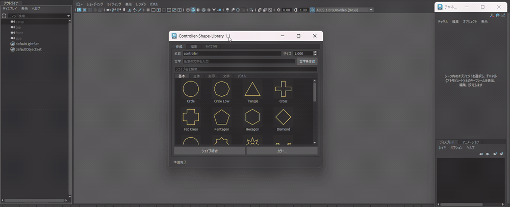
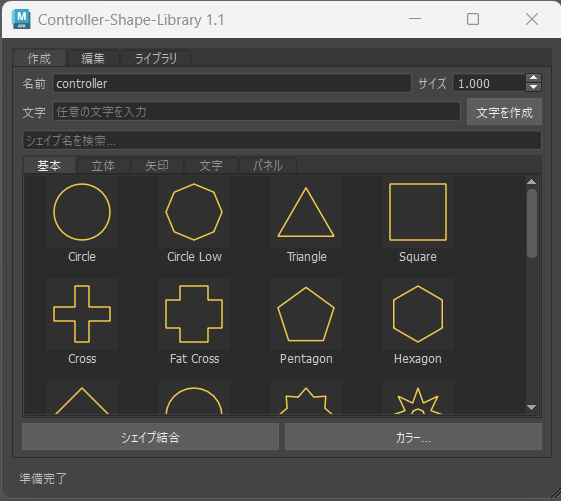
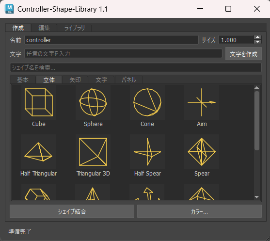
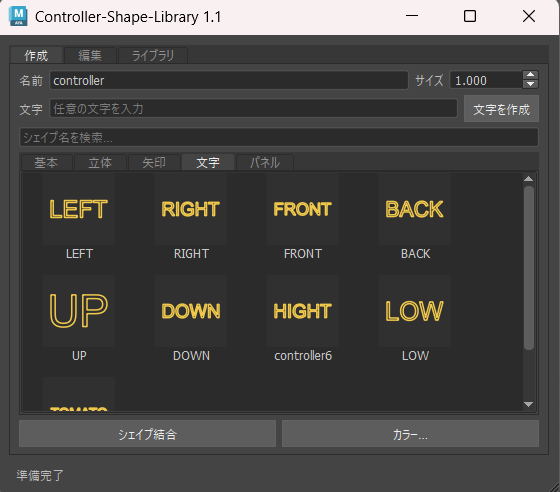
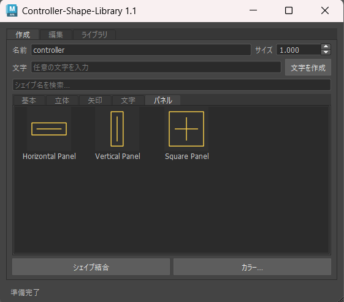
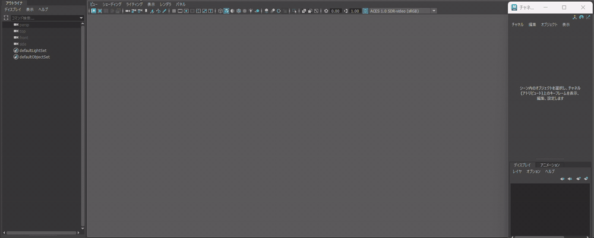
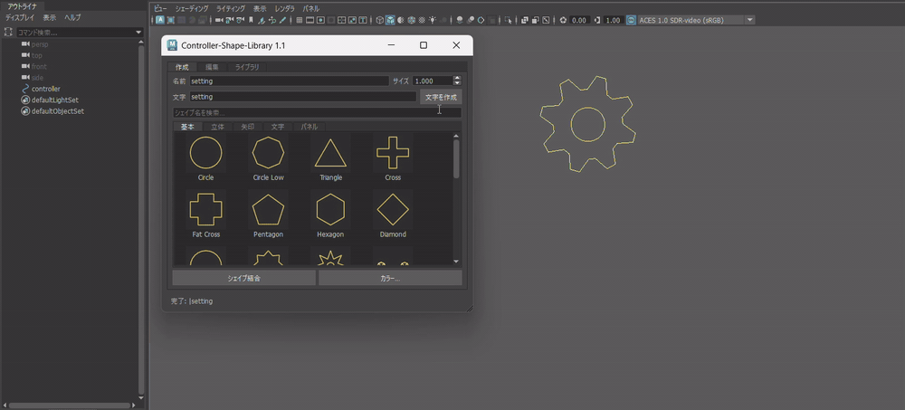
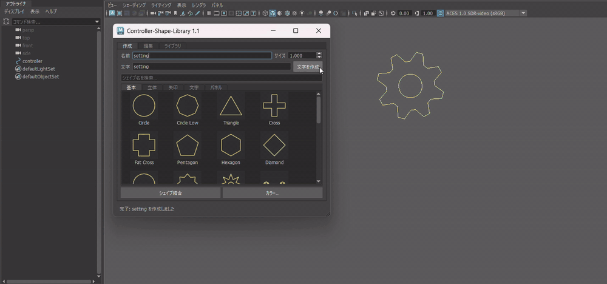
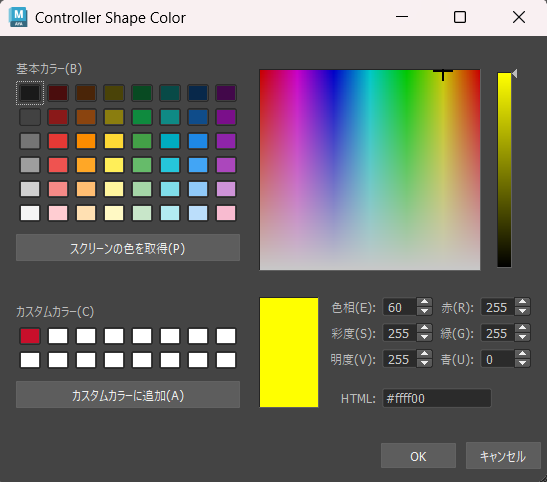

# Controller Shape Library　


Autodesk Maya向けの **Controller Shape作成・管理ツール**です。

Maya 2026 / Python 3 / PySide6 を対象とし、
現在 **71種類以上のController Shapeプリセット**を収録しています。

Controller Shapeを視覚的に選択して生成できるほか、

* 任意の文字からControllerを作成
* Shapeの結合
* カラー設定
* Position / Rotation Snap
* ZERO / OFFSET Groupの作成
* 作成したShapeのLibrary登録

など、Controller作成時に繰り返し発生する操作をまとめています。

また、Controller Shape Library単体で使用するだけでなく、
**他のリギングツールを構成する機能のひとつとして再利用できること**を意識して設計しています。


---

## Preview


### Quick Demo



> Shape選択からController作成、Snap、Color設定、ZERO / OFFSET作成までを一連の流れで行えます。

---

# 制作背景

リギング制作では、Controllerを作成するだけでなく、

1. 使用するShapeを探す
2. Controllerを作成する
3. Jointや対象オブジェクトへ位置を合わせる
4. 用途に応じて色を設定する
5. ZERO / OFFSET Groupを作成する
6. 必要に応じてShapeを組み合わせる

といった細かな操作が繰り返し発生します。

一つひとつは小さな操作ですが、
キャラクター全体のリグを構築する中では何度も繰り返すことになります。

また、用途に合うControllerがない場合には、新しくShapeを作成したり、
過去のMayaシーンから似たControllerを探して再利用したりする必要がありました。

そこで、

> **Controllerを作成するだけではなく、作成・セットアップ・整理・再利用までのワークフローをまとめる**

ことを目的としてController Shape Libraryを制作しました。

---

# Workflow

基本的なController作成を、以下の流れで進められるようにしています。

```text
Shapeを探す / 選択
        ↓
Controller作成
        ↓
必要に応じてShape Combine
        ↓
位置合わせ
        ↓
カラー設定
        ↓
ZERO / OFFSET作成
        ↓
必要に応じてLibraryへ保存
        ↓
別のリグ制作で再利用
```


Shapeを生成する機能だけで終わらせず、
その前後に発生する操作までまとめることで、Controller作成時の反復作業を減らしています。

---

# 主な機能

## Visual Shape Presets

Controller Shapeを一覧から視覚的に確認しながら選択できます。

Shape名だけでは形状を判断しづらいため、
**実際の形を見ながら用途に合ったControllerを探せるUI**にしています。

現在は **71種類のプリセット**を収録しており、用途に応じて5つのカテゴリに分類しています。

---

### 基本 / Basic

**リギングで汎用的に使用しやすい基本Shape。**



---

### 立体 / 3D

**複数方向から視認しやすい立体的なController Shape。**



---

### 矢印 / Arrow

**移動方向や操作方向を直感的に示すDirection Shape。**


---

### 文字 / Text

**LEFT / RIGHTなど、Controllerの役割を直接伝える文字Shape。**



---

### パネル / Panel

**属性操作やリグUIとして使用しやすいパネル型Shape。**



---

プリセットはカテゴリから選択するだけでなく、
**ID / 表示名による検索や並び替え**にも対応しています。



---

## Text Controller

任意の文字からController Shapeを生成できます。


英字だけでなく、

* 日本語
* 数字
* 記号

など、使用するフォントで表示可能な文字をControllerとして利用できます。

例えば、

```text
LEFT
RIGHT
IK
FK
HEAD
A
B
1
2
→
```

のように、リグ上で役割を直接示すControllerとして使用できます。

生成した文字Controllerも通常のCurve Shapeとして扱えるため、
他のShapeとの結合やLibraryへの登録が可能です。

---

## Shape Combine

複数のController Shapeを結合し、
1つのControllerとしてまとめることができます。



例えば、

```text
Arrow + LEFT
Circle + IK
Panel + Text
```

のように、既存ShapeやText Controllerを組み合わせることで、
用途に合わせたControllerを作成できます。

### 結合後の命名

Shape結合後のController名は、用途に応じて選択できます。

* **通常（controller）**：他シェイプ同様Controllerを名前として使用
* **結合先の名前**：結合先Controllerの名前を維持
* **新規**：結合時に任意の名前を入力

作成タブと編集タブの命名設定を共有することで、
**結合のためにタブを移動したり、同じ名前を再入力したりする操作を極力減らしています。**

「新規の名前」を選択した場合のみ命名ダイアログを表示し、
その場で新しいController名を指定できます。



すべての用途に対応するプリセットをあらかじめ用意するのではなく、
**既存Shapeを組み合わせて必要なControllerを作れることに加え、作成から結合まで操作が途切れないワークフロー**を重視しています。

---

## Controller Color

Controller作成時に、任意のRGBカラーを設定できます。



カラー選択にはQtのカラーダイアログを使用しており、
カラーピッカーなどから目的の色を指定できます。

リグやプロジェクトごとのカラー規則に合わせて、
Controllerを視覚的に整理できます。

---

## Controller Setup / Snap / ZERO・OFFSET

作成済みControllerに対して、

* Position / Rotation Snap
* Shape Combine
* ZERO / OFFSET Group作成

など、Controller作成後に必要になるセットアップ操作を行えます。


```text
Controller作成
    ↓
必要に応じてShape Combine
    ↓
Position / Rotation Snap（任意）
    ↓
ZERO / OFFSET（任意）
```

SnapやZERO / OFFSETは必須ではなく、
用途に応じて必要な処理のみ使用できます。

Scale / Rotate / Move / Replace / Add / Copy / PasteなどのShape操作についてはPublic APIとして公開しており、
他のリギングツールへ組み込んで利用できます。

### ZERO / OFFSET

ZERO / OFFSET Groupは、それぞれ単独で作成できます。

ZERO Group作成時には、Controllerの現在のTransformを保持したまま
値をZERO Group側へ移し、Controller自身のTransformを0に戻すことができます。

```text
Before

Controller
Translate / Rotate = 現在値

        ↓ ZERO作成

ZERO        ← Transform値を保持
└─ Controller
   Translate / Rotate = 0
```

これにより、Controllerの現在位置を初期姿勢として維持したまま、
アニメーション用のTransformを0から扱える状態にできます。

ZERO、OFFSETの順に作成した場合は、以下の階層になります。

```text
ZERO
└─ OFFSET
   └─ Controller
```

命名規則についても固定せず、

```text
CTRL_ZERO
ZERO_CTRL
CTRL_OFFSET
OFFSET_CTRL
```

のようにprefix / suffixを変更できます。


プロジェクトごとの命名規則に合わせて使用できるようにしています。

---

# Custom Shape Library

制作中に作成したController Shapeを、
独自のプリセットとしてLibraryへ登録できます。


登録したShapeはMayaシーンではなくJSONで管理しています。

```text
Controller-Shape-Library/
└── libraries/
    └── user_shapes.json
```

そのため、一度作成したControllerを現在のMayaシーンだけで終わらせず、
**別のシーンや別のリグ制作でも再利用できます。**

Libraryでは以下の操作に対応しています。

* Shapeの保存 / 上書き
* 保存済みShapeからControllerを作成
* 登録内容の更新
* Shapeの削除
* カテゴリ変更
* タブ追加
* タブ名変更
* タブ並び替え
* タブ削除
* Library操作のUndo / Redo

---

# 問題解決と設計

## 1. Shapeが増えるほど探しづらくなる

### Problem

Controller Shapeの種類を増やすだけでは、
一覧が大きくなり、目的のShapeを探す時間も増えてしまいます。

「Shapeは用意されているが、どこにあるのか分からない」という状態では、
プリセットを増やすメリットが小さくなります。

### Solution

Shapeを視覚的に確認できるUIに加えて、

* カテゴリ分け
* 検索
* 並び替え

を実装しました。


Custom Shape Libraryについてもカテゴリを編集できるようにし、
ユーザー自身が用途や使用頻度に合わせて整理できる構成にしています。

---

## 2. プリセットだけではすべての用途に対応できない

### Problem

必要になるController Shapeはリグによって異なるため、
プリセットを増やし続けても、すべてのケースを事前に用意することはできません。

### Solution

そこで、

> **用意されたShapeを選ぶだけでなく、必要なShapeを作れること**

を重視しました。

Text ControllerとShape Combineを組み合わせることで、
既存プリセットから用途に合わせたControllerを作成できます。


さらに完成したShapeをLibraryへ登録することで、

```text
作成
 ↓
カスタマイズ
 ↓
Libraryへ登録
 ↓
別のリグで再利用
```

というワークフローにつなげています。

---

## 3. Mayaシーンに依存すると再利用しづらい

### Problem

作成したControllerをMayaシーン内だけで管理すると、
別のリグで使用するときに元のシーンを開いたり、Controllerをコピーしたりする必要があります。

### Solution

Custom ShapeをJSONとして外部保存する方式にしました。

ShapeデータをMayaシーンから分離することで、
別のシーンでも同じControllerを生成できます。

一度作ったControllerを使い捨てにせず、
**制作を続けるほど自分のShape Libraryが蓄積されていく仕組み**を目指しています。

---

# 他ツールへの組み込み

Controller Shape Libraryは単体ツールとして使用するだけでなく、
**他のリギングツールを構成する機能のひとつとして再利用できる設計**にしています。

Controller生成やShape操作などの処理をUIから分離し、
必要な機能を外部のツールから呼び出せる構成にしています。

## 実装例：Rig Controller Shape Tool

実際に、自作の **Rig Controller Shape Tool** に
Controller Shape Libraryを組み込んで使用しています。


### 実際の呼び出し


Rig Controller Shape Toolでは、

* Uniform Scale
* Scale / Rotate / Move
* Line Width
* Joint Size
* Color
* Copy / Paste
* Shape編集

など、Controllerの調整に関する機能をまとめています。

その中の **Shape Library機能としてController Shape Libraryを呼び出す**ことで、
Controller Shapeの作成・選択機能を再実装せず利用できるようにしています。

```text
Rig Controller Shape Tool
│
├─ Scale / Rotate / Move
├─ Line Width / Joint Size
├─ Color
├─ Copy / Paste
│
└─ Shape Library
      │
      └─ Controller Shape Library
```

---

## なぜ独立させたか

複数のリギングツールを制作していくと、
Controller生成のような共通処理が複数のツールで必要になります。

それぞれに同じ処理を実装すると、

```text
Tool A ─ Controller生成処理
Tool B ─ Controller生成処理
Tool C ─ Controller生成処理
```

のように処理が重複し、
機能追加や修正のたびに複数箇所を更新する必要があります。

そこでController Shapeに関する処理を独立させ、

```text
                       ┌─ Rig Controller Shape Tool
                       │
Controller Shape       ├─ Rig Builder
Library / API ─────────┤
                       ├─ Auto Rig Tool
                       │
                       └─ Other Rig Tools
```

のように、**複数のツールから共通機能として利用できる構成**を意識しました。

これにより、新しいリギングツールを制作するときも、
Controller Shapeに関する処理を一から作り直すのではなく、
必要な機能を組み込んで利用できます。

また、Controller Shape Library側の処理を改善することで、
同じ機能を利用するツール側にも改善を反映しやすくなります。

> **単体ツールとして完結させながら、他のリギングツールを構成する機能単位としても再利用できること**
>
> を、このツールの設計方針のひとつとしています。

---

# Public API

`controller_shape_library.api` から、
Controller Shapeに関する処理をUIとは独立して呼び出せます。

現在、**35の公開関数**を用意しています。

主な機能は以下です。

```text
Controller生成
Text Controller生成
Shape Combine
Shape Replace / Add
Copy / Paste
Scale / Rotate / Move
Color設定
Snap
ZERO / OFFSET作成
JSON Import / Export
Custom Shape Library管理
カテゴリ / タブ管理
```

例えば、Controller生成処理は以下のように外部から呼び出せます。

```python
from controller_shape_library import api

ctrl = api.create_controller(
    shape="circle",
    name="L_arm_CTRL",
    size=2.0
)
```

UIとController処理を分離することで、
Controller Shape LibraryのUIを開かずに、別のツールから必要な処理だけを利用できます。

---

# テスト

機能追加によって既存のController Shapeや処理に意図しない変更が発生していないか確認するため、
データおよびMaya上での動作確認用テストを用意しています。

主要な既存Shapeについてデータを記録し、
変更によって意図しない形状差分が発生していないか確認できる構成にしています。

---

# Installation

## 1. ファイルを配置

`Controller-Shape-Library` フォルダを任意の場所へ配置します。

## 2. Module Pathを設定

`ControllerShapeLibrary.mod` の1行目を、
実際に配置したController-Shape-Libraryのパスへ変更します。

## 3. MayaへModuleを登録

`.mod` ファイルをMayaのmodulesフォルダへ配置し、
Mayaを再起動します。

## 4. 起動

Maya Script EditorのPythonタブで以下を実行します。

```python
import launch_controller_shape_library
```

開発中のチェックアウトから直接起動する場合も、
同じLauncherを使用できます。

---

# Environment

```text
Autodesk Maya 2026
Python 3
PySide6
```

---

# Design Goals

このツールでは、主に以下の3点を意識して設計しています。

### 1. Controller作成のワークフローをまとめる

Shape生成だけでなく、Combine・Snap・Color・Group作成までまとめ、
Controller作成時に発生する反復操作を減らす。

### 2. ユーザー自身が拡張できる

すべてのShapeを最初から用意するのではなく、
ユーザーが必要なShapeを作成・登録・整理し、再利用できるようにする。

### 3. 他のリギングツールから再利用できる

Controller Shapeに関する処理を独立させ、
単体ツールとしてだけでなく、他のツールを構成する共通機能として利用できるようにする。

---

# License

This project is licensed under the MIT License.

Copyright (c) 2026 Yuzuki Midoshima
